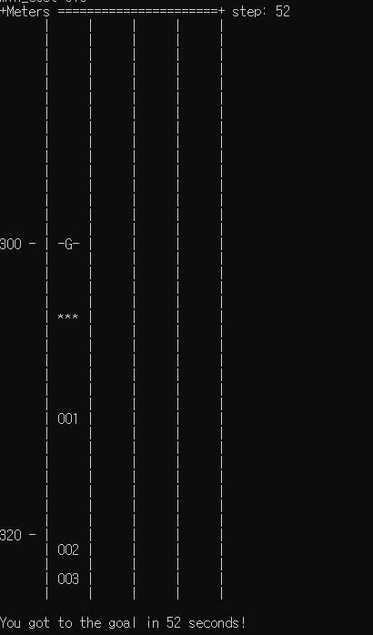
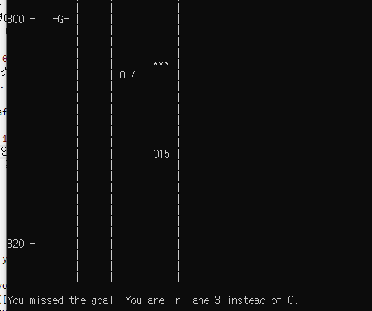

# Week 6 - Prediction & Behaviour Planning

## Report #1

### train
```python
def train(self, X, Y):
	'''
	Collect the data and calculate mean and standard variation
	for each class. Record them for later use in prediction.
	'''

	data_seperation = {}
	self.data_stat = {}

	for i, clss in enumerate(Y) : 
		if clss not in data_seperation : 
			data_seperation[clss] = []
			self.data_stat[clss] = {}

		data_seperation[clss].append(X[i])
	
	for clss in data_seperation : 
		data = np.array(data_seperation[clss])

		means = np.mean(data, axis=0)
		stds = np.std(data, axis=0)

		self.data_stat[clss]['means'] = means
		self.data_stat[clss]['stds'] = stds
		self.data_stat[clss]['len'] = data.shape[0]
```
- 각 클래스에 맞게 데이터를 나눈 후 각 클래스의 각 변수에 대해 mean, std, 데이터 갯수를 dictionary형태로 저장했다.

### prediction
```python
def predict(self, observation):
	'''
	Calculate Gaussian probability for each variable based on the
	mean and standard deviation calculated in the training process.
	Multiply all the probabilities for variables, and then
	normalize them to get conditional probabilities.
	Return the label for the highest conditional probability.
	'''
	probs = []
	total_len = sum(self.data_stat[clss]['len'] for clss in self.data_stat)

	for clss in self.data_stat : 
		prob = self.data_stat[clss]['len'] / total_len

		for i in range(len(observation)) : 
			mean = self.data_stat[clss]['means'][i]
			std = self.data_stat[clss]['stds'][i]
			prob *= gaussian_prob(observation[i], mean, std)

		probs.append(prob)

	return list(self.data_stat.keys())[np.argmax(probs)]
```
- `train`에서 구한 statistics를 이용하여 각 클래스에 대한 확률을 구한 후 가장 큰 확률을 가지는 클래스를 리턴한다.
- 구현한 코드로 `prediction.py`를 실행한 결과 84.40%의 정확도를 얻을 수 있었다.

## Report #2

### Task 1

```python
def choose_next_state(self, predictions):
	possible_successor_states = self.successor_states()

	min_cost = 1000000
	best_trajectory = None

	for state in possible_successor_states :

		trajectory = self.generate_trajectory(state, predictions)
		cost = calculate_cost(self, trajectory, predictions)

		if cost < min_cost : 
			min_cost = cost
			best_trajectory = trajectory

	return best_trajectory 
```

1. 가능한 모든 state들에 대해 trajectory를 계산한다.
2. 계산한 trajectory에 대한 cost를 계산한다.
3. 가장 작은 cost를 가지는 trajectory를 리턴한다.

### Task 2
```python
def goal_distance_cost(vehicle, trajectory, predictions, data):
    '''
    Cost increases based on distance of intended lane (for planning a
    lane change) and final lane of a trajectory.
    Cost of being out of goal lane also becomes larger as vehicle approaches
    the goal distance.
    '''

    distance_weight = abs(vehicle.goal_s - data.end_distance_to_goal)
    lane_diff = abs(vehicle.goal_lane - data.intended_lane)
    lane_diff += abs(vehicle.goal_lane - data.final_lane)

    return lane_diff * distance_weight

def inefficiency_cost(vehicle, trajectory, predictions, data):
    '''
    Cost becomes higher for trajectories with intended lane and final lane
    that have slower traffic.
    '''
    intended = velocity(predictions, data.intended_lane) or vehicle.target_speed
    final = velocity(predictions, data.final_lane) or vehicle.target_speed

    return -(intended + final)
```
- `goal_distance_cost` : goal_lane과 intended lane, final lane과의 차이에 distance weight를 곱해 구현하였다. 목표 lane에 들어와 있으면 cost는 0이 되고, 목표 lane에 들어와 있지 않을 때는 목표 지점과의 거리에 비례해 cost가 올라간다. 
	- `REACH_GOAL = 1, EFFICIENCY = 0`으로 weight를 설정하면 그림과 같이 목표 레인으로 ego가 바로 움직이는 것을 확인할 수 있다. 목표 지점까지 도달하는 데 걸리는 속도는 52초이다. 
	- 
- `inefficiency_cost` : intended traffic과 final traffic 의 합에 -를 취해서 간단하게 구현하였다. 
	- `REACH_GOAL = 0, EFFICIENCY = 1`으로 weight를 설정하면 속도가 가장 빠른 레인에만 ego가 머물어 목표 레인에 제대로 도달하지 않는 것을 확인할 수 있다. 목표 지점까지 도달하는 데 걸리는 속도는 34초이다.
	- 
- `REACH_GOAL = 0.005, EFFICIENCY = 0.995`으로 weight를 설정하면 34초만에 목표 지점에 도달하는 것을 확인할 수 있었다.  `goal_distance_cost`의 수치가 `inefficiency_cost`의 수치보다 일반적으로 크기 때문에 이러한 파라미터를 적용했다. 각 cost에 정규화를 적용한다면 조금 더 쉽게 weight를 조절할 수 있을 것이다. 
---

## Assignment #1

Under the directory [./GNB](./GNB), you are given two Python modules:

* `prediction.py`: the main module you run. The `main()` function does two things: (1) read an input file ([`train.json`](./GNB/train.json)) and train the GNB (Gaussian Naive Bayes) classifier using the data stored in it, and (2) read another input file ([`test.json`](./GNB/test.json)) and make predictions for a number of data points. The accuracy measure is taken and displayed.
* `classifier.py`: main implementation of the GNB classifier. You shall implement two methods (`train()` and `precict()`), which are used to train the classifier and make predictions, respectively.

Both input files ([`train.json`](./GNB/train.json) and [`test.json`](./GNB/test.json)) have the same format, which is a JSON-encoded representation of training data set and test data set, respectively. The format is shown below:

```
{
	"states": [[s_1, d_1, s_dot_1, d_dot_1],
	           [s_2, d_2, s_dot_2, d_dot_2],
	           ...
	           [s_n, d_n, s_dot_n, d_dot_n]
	          ],
	"labels": [L_1, L_2, ..., L_n]
}
```

The array `"states"` have a total of `n` items, each of which gives a (hypothetically) measured state of a vehicle, where `s_i` and `d_i` denote its position in the Frenet coordinate system. In addition, `s_dot_i` and `d_dot_i` give their first derivates, respectively. For each measured state, a label is associated (given in the `"labels"` array) that represents the vehicle's behaviour. The label is one of `"keep"`, `"left"`, and `"right"`, which denote keeping the current lane, making a left turn, and making a right turn, respectively.

The training set has a total of 750 data points, whereas the test set contains 250 data points with the ground truth contained in `"labels"`.

The GNB classifier is trained by computing the mean and variance of each component in the state variable for each observed behaviour. Later it is used to predict the behaviour by computing the Gaussian probability of an observed state for each behaviour and taking the maximum. You are going to implement that functionality. For convcenience, a separate function `gaussian_prob()` is already given in the module `classifier.py`.


---

## Assignment #2

Under the directory [./BP](./BP), you are given four Python modules:

* `simulate_behavior.py`: the main module you run. It instantiates a simple text-based simulation environment and runs it using the configuration specified in the same module.
* `road.py`: `class Road` is implemented here. It captures the state of the simulated road with a number of vehicles (including the ego) running on it, and visualizes it using terminal output.
* `vehicle.py`: `class Vehicle` implements the states of a vehicle and its transition, along with the vehicle's dynamics based on a simple kinematic assumption. Note that a vehicle's trajectory is represented by two instances of object of this class, where the first one gives the current state and the second one predicts the state that the vehicle is going to be in after one timestep.
* `cost_functions.py`: implementation of cost functions governing the state transition of the ego vehicle. The main job required for your assignment is to provide an adequate combination of cost functions by implementing them in this module.

### Task 1

Implement the method `choose_next_state()` in `vehicle.py`. It should

* determine which state transitions are possible from the current state (`successor_states()` function in the same module will be helpful),
* calculate cost for each state transition using the trajectory generated for each behaviour, and
* select the minimum cost trajectory and return it.

Note that you must return a planned trajectory (as described above) instead of the state that the vehicle is going to be in.

### Task 2

In `cost_functions.py`, templates for two different cost functions (`goal_distance_cost()` and `inefficiency_cost()`) are given. They are intended to capture the cost of the trajectory in terms of

* the lateral distance of the vehicle's lane selection from the goal position, and
* the time expected to be taken to reach the goal (because of different lane speeds),

respectively.

Note that the range of cost functions should be carefully defined so that they can be combined by a weighted sum, which is done in the function `calculate_cost()` (to be used in `choose_next_state()` as described above). In computing the weighted sum, a set of weights are used. For example, `REACH_GOAL` and `EFFICIENCY` are already defined (but initialized to zero values). You are going to find out a good combination of weights by an empirical manner.

You are highly encouraged to experiment with your own additional cost functions. In implementing cost functions, a trajectory's summary (defined in `TrajectoryData` and given by `get_helper_data()`) can be useful.

You are also invited to experiment with a number of different simulation settings, especially in terms of

* number of lanes
* lane speed settings (all non-ego vehicles follow these)
* traffic density (governing the number of non-ego vehicles)

and so on.

Remember that our state machine should be geared towards reaching the goal in an *efficient* manner. Try to compare a behaviour that switches to the goal lane as soon as possible (note that the goal position is in the slowest lane in the given setting) and one that follows a faster lane and move to the goal lane as the remaining distance decreases. Observe different behaviour taken by the ego vehicle when different weights are given to different cost functions, and also when other cost metrics (additional cost functions) are used.

