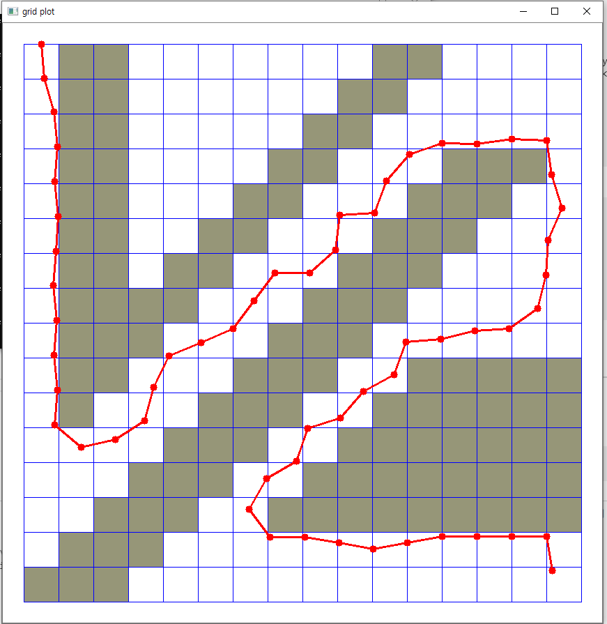

# Week 7 - Hybrid A* Algorithm & Trajectory Generation

## Report
### expand()

```python
def expand(self, current, goal):
    g = current['g']
    x, y, theta = current['x'], current['y'], current['t']
    # The g value of a newly expanded cell increases by 1 from the
    # previously expanded cell.
    g2 = g + 1
    next_states = []

    # Consider a discrete selection of steering angles.
    for delta_t in range(self.omega_min, self.omega_max, self.omega_step):

        omega = self.speed / self.length * np.tan(np.radians(delta_t))
        next_x = x + self.speed * np.cos(theta)
        next_y = y + self.speed * np.sin(theta)
        next_theta = self.normalize_angle(theta + omega)
        next_f = g2 + self.heuristic(next_x, next_y, goal)
        s = {
            'x' : next_x,
            'y' : next_y,
            't' : next_theta,
            'f' : next_f, 
            'g' : g2
        }
        next_states.append(s)

    return next_states
```
- simple bicyble model에 따라 현재 state에서 갈 수 있는 모든 state를 저장한다.
- angle normalize를 위해 아래의 함수를 구현했다. 
```python
def normalize_angle(self, angle):
    pi_2 = 2. * np.pi
    return fmod(fmod(angle, pi_2) + pi_2, pi_2) 
```

### search()
```python
def search(self, grid, start, goal):
    # ... 
    while len(opened) > 0:
        opened.sort(key=lambda s : s['f'], reverse=True)
        curr = opened.pop()
        x, y = curr['x'], curr['y']
        if (self.idx(x), self.idx(y)) == goal:
            self.final = curr
            found = True
            break

        # Compute reachable new states and process each of them.
        next_states = self.expand(curr, goal)
        for n in next_states:
            n_x, n_y, n_theta = n['x'], n['y'], n['t']
            stack = self.theta_to_stack_num(n_theta)

            # Check validity of the state
            idx_x, idx_y = self.idx(n_x), self.idx(n_y)
            if 0 <= idx_x < grid.shape[0] and 0 <= idx_y < grid.shape[1] and \
                self.closed[stack][idx_x][idx_y] == 0 and grid[(idx_x, idx_y)] == 0: 
                
                # Check grid validity 
                if self.validity(x, y, n_x, n_y, grid):

                    self.came_from[stack][idx_x][idx_y] = curr
                    self.closed[stack][idx_x][idx_y] = 1 # mark as closed
                    opened.append(n) # add to opened list
                    total_closed += 1

    else:
        # We weren't able to find a valid path; this does not necessarily
        # mean there is no feasible trajectory to reach the goal.
        # In other words, the hybrid A* algorithm is not complete.
        found = False

    return found, total_closed
```
- `expand()` 를 이용해 얻은 next_state들을 하나씩 방문하며 next state n에 도달할 수 있는지 여부를 판단한다. 
- 각도에 따라 장애물을 지나칠 수 있기 때문에 아래의 함수를 통해 current state - next state 사이에 장애물이 있는지 여부를 판단했다. 이를 위해 Line rasterization 알고리즘을 이용했는데, 이보다 더 효율적으로 계산할 수 있을 것이다.
```python
def validity(self, x, y, n_x, n_y, grid): 
    dx = n_x - x
    dy = n_y - y
    step_size = 0.03

    if (abs(dx) > abs(dy)) : 
        rang = np.arange(x, n_x, step_size)
        for new_x in rang : 
            slope = dy / dx
            new_y = slope * (new_x - x) + y
            id_x, id_y = self.idx(new_x), self.idx(new_y)
            if 0 <= id_x < grid.shape[0] and 0 <= id_y < grid.shape[1] and \
                grid[(id_x, id_y)] == 0 : 
                continue 
            else : return False
    else : 
        rang = np.arange(y, n_y, step_size)
        for new_y in rang : 
            slope = dx / dy
            new_x = slope * (new_y - y) + x
            id_x, id_y = self.idx(new_x), self.idx(new_y)
            if 0 <= id_x < grid.shape[0] and 0 <= id_y < grid.shape[1] and \
                grid[(id_x, id_y)] == 0 : 
                continue 
            else : return False

    return True
```

### theta_to_stack_num(), heuristic()
```python
def theta_to_stack_num(self, theta):
    interval = np.radians(360 / self.NUM_THETA_CELLS)
    return int(theta // interval)

def heuristic(self, x, y, goal):
    goal_x, goal_y = goal
    ret = np.sqrt((x - goal_x)**2 + (y - goal_y)**2)
    return ret
```
- 휴리스틱은 간단하게 euclidean distance로 계산했다.

### 결과
- start : `(0.0, 0.5, 0.1)`
- `NUM_THETA_CELLS = 90`
- `speed = 1.0`


- start : `(0.0, 0.5, 0.1)`
- `NUM_THETA_CELLS = 360`
- `speed = 0.5`


---

[//]: # (Image References)
[has-example]: ./hybrid_a_star/has_example.png
[ptg-example]: ./PTG/ptg_example.png

## Assignment: Hybrid A* Algorithm

In directory [`./hybrid_a_star`](./hybrid_a_star), a simple test program for the hybrid A* algorithm is provided. Run the following command to test:

```
$ python main.py
```

The program consists of three modules:

* `main.py` defines the map, start configuration and end configuration. It instantiates a `HybridAStar` object and calls the search method to generate a motion plan.
* `hybrid_astar.py` implements the algorithm.
* `plot.py` provides an OpenCV-based visualization for the purpose of result monitoring.

You have to implement the following sections of code for the assignment:

* Trajectory generation: in the method `HybridAStar.expand()`, a simple one-point trajectory shall be generated based on a basic bicycle model. This is going to be used in expanding 3-D grid cells in the algorithm's search operation.
* Hybrid A* search algorithm: in the method `HybridAStar.search()`, after expanding the states reachable from the current configuration, the algorithm must process each state (i.e., determine the grid cell, check its validity, close the visited cell, and record the path. You will have to write code in the `for n in next_states:` loop.
* Discretization of heading: in the method `HybridAStar.theta_to_stack_num()`, you will write code to map the vehicle's orientation (theta) to a finite set of stack indices.
* Heuristic function: in the method `HybridAStar.heuristic()`, you define a heuristic function that will be used in determining the priority of grid cells to be expanded. For instance, the distance to the goal is a reasonable estimate of each cell's cost.

You are invited to tweak various parameters including the number of stacks (heading discretization granularity) and the vehicle's velocity. It will also be interesting to adjust the grid granularity of the map. The following figure illustrates an example output of the program with the default map given in `main.py` and `NUM_THETA_CELLS = 360` while the vehicle speed is set to 0.5.

![Example Output of the Hybrid A* Test Program][has-example]

---

## Experiment: Polynomial Trajectory Generation

In directory [`./PTG`](./PTG), a sample program is provided that tests polynomial trajectory generation. If you input the following command:

```
$ python evaluate_ptg.py
```

you will see an output such as the following figure.

![Example Output of the Polynomial Trajectory Generator][ptg-example]

Note that the above figure is an example, while the result you get will be different from run to run because of the program's random nature. The program generates a number of perturbed goal configurations, computes a jerk minimizing trajectory for each goal position, and then selects the one with the minimum cost as defined by the cost functions and their combination.

Your job in this experiment is:

1. to understand the polynomial trajectory generation by reading the code already implemented and in place; given a start configuration and a goal configuration, the algorithm computes coefficient values for a quintic polynomial that defines the jerk minimizing trajectory; and
2. to derive an appropriate set of weights applied to the cost functions; the mechanism to calculate the cost for a trajectory and selecting one with the minimum cost is the same as described in the previous (Week 6) lecture.

Experiment by tweaking the relative weight for each cost function. It will also be very interesting to define your own cost metric and implement it using the information associated with trajectories.
